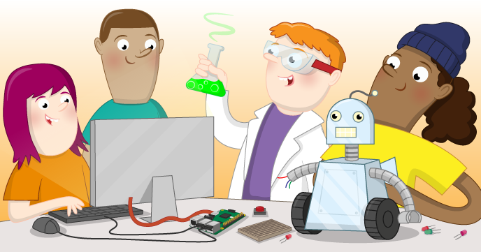

## What you will make

You'll make a side-on fighting game where a stickman hero takes on a giant, city-stomping dinosaur in the middle of Tokyo. The player moves the fighter left and right and throws punches, kicks, and sword slashes to knock the dinosaur back — before it bites away all of the fighter's health.

> [!NOPRINT]
>
> Try the finished project. Click the green flag, then use the keys below to fight back.
>
> 

> <iframe allowtransparency="true" width="485" height="402" src="https://scratch.mit.edu/projects/embed/1363544226/?autostart=false" frameborder="0"></iframe>
> 

> [!PRINTONLY]
>
> 

The player controls the fighter with the keyboard:

- `left arrow`{:class="block3sensing"} and `right arrow`{:class="block3sensing"} — walk
- `space`{:class="block3sensing"} — punch
- `m`{:class="block3sensing"} — kick
- `n`{:class="block3sensing"} — sword slash
- `v`{:class="block3sensing"} — dash roll
- `up arrow`{:class="block3sensing"} — jump

The fighter is only dangerous **mid-strike**: as a punch, kick, or slash lands, the fists and weapon flash a bright colour. If the dinosaur runs into that colour it gets knocked back and destroyed. If it reaches the fighter at any other time, it bites, and the fighter loses health.

> [!NOPRINT]
>
> Open the starter project to begin: [Stickman Battle starter](https://scratch.mit.edu/projects/1363542597/editor).
