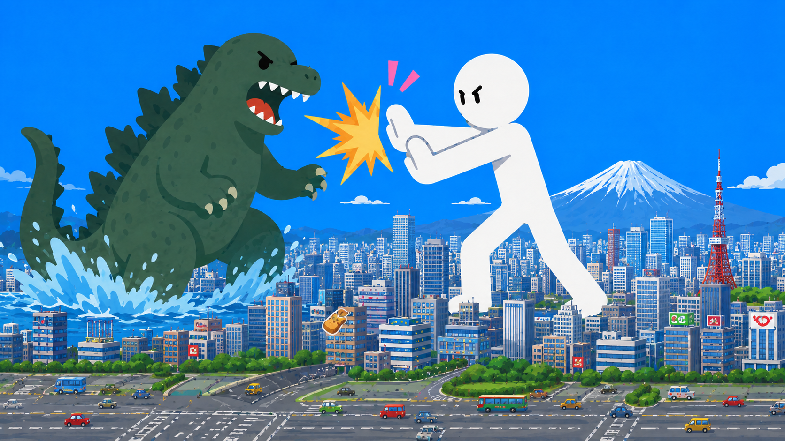

## What you will make

Make a side-on fighting game where a stickman hero battles giant, city-stomping dinosaurs in Tokyo.

> [!NOPRINT]
>
> Try the finished project. Click the green flag, then use the keys below to fight back.
>
> 

> <iframe allowtransparency="true" width="485" height="402" src="https://scratch.mit.edu/projects/embed/1363544226/?autostart=false" frameborder="0"></iframe>
> 

> [!PRINTONLY]
>
> 

Move the fighter left and right, then punch, kick, or slash the dinosaurs before they bite away all the fighter's health.

Use these keys:

- `left arrow`{:class="block3events"} and `right arrow`{:class="block3events"} — walk
- `space`{:class="block3events"} — punch
- `m`{:class="block3events"} — kick
- `n`{:class="block3events"} — sword slash
- `v`{:class="block3events"} — dash roll
- `up arrow`{:class="block3events"} — jump

During a punch, kick, or slash, the fighter's fist, foot, or weapon flashes a bright colour. A dinosaur that touches this colour is knocked back. At any other time, the dinosaur bites and the fighter loses health.
