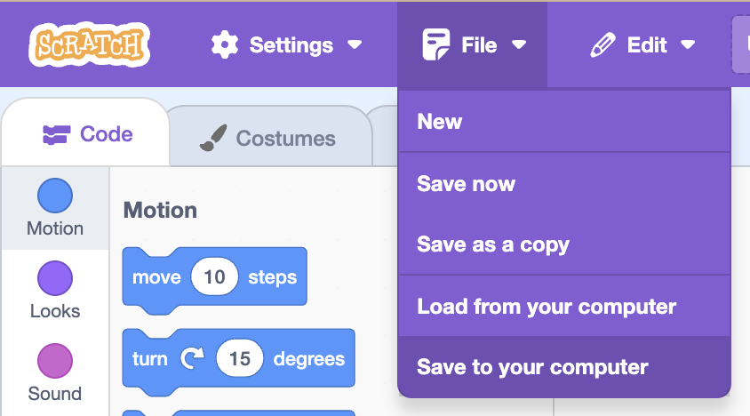

## Keep score and set the scene

Add a score, save the highest score, and choose a backdrop.

> [!TASK]
>
> Make two variables and **tick** both so they appear on the stage:
>
> - `score`{:class="block3variables"} — how long the player has lasted
> - `high score`{:class="block3variables"} — the best score in this play session
>
> 
>
> 

> [!TASK]
>
> Select the **Stage** and reset the score when the green flag is clicked.
>
> <p align="center"></p>
>
> ```blocks3
> when green flag clicked
> set [score v] to (0)
> ```

> [!TASK]
>
> On the **Stage**, add one point per second while the game is running. When the game ends, save `score`{:class="block3variables"} as the new `high score`{:class="block3variables"} if it is higher.
>
> ```blocks3
> when I receive (dino v)
> repeat until <(playing) = (0)>
> wait (1) seconds
> change [score v] by (1)
> end
> if <(score) > (high score)> then
> set [high score v] to (score)
> end
> ```

> [!TASK]
>
> Open the **Backdrops** tab. Choose the day, sunset, or night version of Tokyo.
>
> 

> [!TASK]
>
> **Optional:** On the **player** sprite, change the `game over`{:class="block3myblocks"} block so it says the final `score`{:class="block3variables"}.
>
> <p align="center"></p>

> [!TASK]
>
> Save your project so you don't lose your work.
>
> 

> [!SAVE]

**Test:** Play a full round. Your score should climb each second, the game should end when your health runs out, and your best run should stick as the high score.
