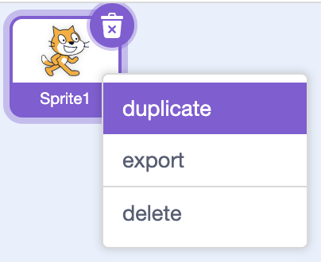

## Challenge: a two-player battle

You've survived the enemy waves — now turn Stickman Battle into a real fight between **two** fighters, where each player controls their own stickman and only one is left standing.

This is your project to shape. The prompts below are things you *could* try, not steps to follow. If you get stuck on one, open its hint for a nudge.

> [!CHALLENGE]
>
> + Can you give the fighter a rival by making a second stickman that already knows how to punch, kick, and slash?
> + Can you make the two fighters easy to tell apart by giving each one its own strike colour on its fists?
> + Can you set the second fighter up on the other side of the stage, facing its opponent, the moment the green flag is clicked?
> + Can you make each fighter feel a hit by sensing the *other* fighter's strike colour?
> + Can you say goodbye to the enemy sprite and build a proper two-player fight?

> [!HINT]
>
> You don't have to build a second fighter from scratch. There's a way to make a copy of the whole `player` sprite — costumes, sounds, and all its scripts — so your second stickman starts out already able to do everything the first one can.
>
> 

> [!HINT]
>
> Think back to how the enemy knew it had run into a real strike: it checked for a bright colour that only appears on the fists *during* a punch, kick, or slash. If both fighters share that same colour, they'll have no way to tell their own strikes from their rival's. Recolouring one fighter's strike frames — the punch, kick, and slash costumes — gives each fighter a strike colour of its own.

> [!HINT]
>
> Two fighters starting in the same place, facing the same way, won't feel like a battle. Look at how the first fighter sets itself up when the green flag is clicked, and think about where the second one should begin and which way it should be turned so the two face each other from opposite sides.

> [!HINT]
>
> The enemy only reacted to the fighter's strike colour, and nothing else. Each of your fighters can do the same: sense the *opponent's* strike colour to know when it's actually being hit. For this to work, each strike colour needs to be unique to the fists — if the same colour appears anywhere in the backdrop, a fighter will think it's being struck when it isn't.

> [!HINT]
>
> The enemy belongs to the old game — you can remove its sprite entirely. Then think about what a fair fight needs: each fighter wants its own controls (the first one already uses the arrow keys, `space`{:class="block3sensing"}, `m`{:class="block3sensing"}, and `n`{:class="block3sensing"}, so the second needs a different set), its own health so a hit lowers the right fighter, and a way to decide who wins when one fighter's health runs out.

> [!TIP]
>
> Change one thing at a time and test after each: make the copy fight, then recolour it, then move it, then wire up its sensing. It's much easier to spot what's gone wrong when you've only just changed it.

> [!SAVE]
