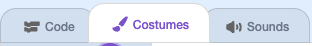
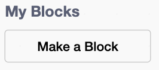
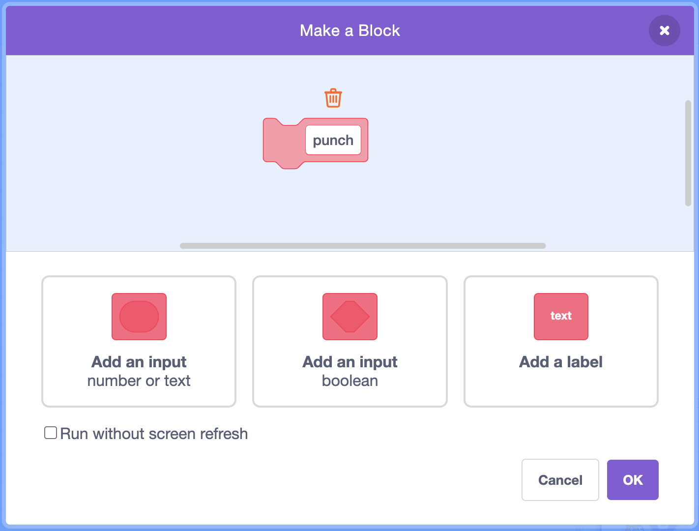
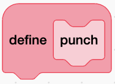

## Animate a punch

Your fighter already has all its frames drawn as costumes. In this step you'll turn the punch frames into a smooth punch animation and play it when the player presses a key.

> [!TASK]
>
> Open the [Stickman Battle starter project](https://scratch.mit.edu/projects/1363542597/editor){:target="_blank"} in a new tab.

> [!TASK]
>
> Click the `player`{:class="block3looks"} sprite, then open the **Costumes** tab to see its frames. Find the ones named `punch_01` to `punch_06` — these are the drawings that make up one punch.
>
> 

> [!TIP]
>
> A moving character is really just a set of still pictures shown one after another, exactly like a flip book. Each picture is one **frame**, and swapping frames quickly is how you **animate** a sprite.

> [!TASK]
>
> You'll build the punch as its own block you can reuse. In the **My Blocks** palette, click **Make a Block**.
>
> 
>
> Name it `punch`{:class="block3custom"} and click **OK**.
>
> 
>
> A `define punch`{:class="block3custom"} hat appears for you to build on.
>
> 

> [!TIP]
>
> A block you make yourself is a **custom block**. Wrapping a job up in its own named block is called **abstraction**: once the punch lives inside `punch`{:class="block3custom"}, you can trigger the whole animation with a single block and never worry about the frames again.

> [!TASK]
>
> Under `define punch`{:class="block3custom"}, play a sound so the hit lands, then switch through the punch frames with a short wait after each one. Use `start sound`{:class="block3sound"} (not `play sound until done`{:class="block3sound"}) so the sound doesn't hold up the animation.
>
> <p align="center"></p>
>
> ```blocks3
> define punch
> start sound (Tennis Hit v)
> switch costume to (punch_01 v)
> wait (0.01) seconds
> switch costume to (punch_02 v)
> wait (0.01) seconds
> switch costume to (punch_03 v)
> wait (0.01) seconds
> switch costume to (punch_04 v)
> wait (0.01) seconds
> switch costume to (punch_05 v)
> wait (0.01) seconds
> switch costume to (punch_06 v)
> wait (0.01) seconds
> switch costume to (punch_02 v)
> wait (0.01) seconds
> switch costume to (punch_01 v)
> wait (0.02) seconds
> ```

> [!TIP]
>
> The punch runs up to `punch_06` and then back down through `punch_02` to `punch_01`, so the arm swings out **and** comes back to rest. Playing frames forwards then backwards is a quick way to make an action return to where it started.

> [!TASK]
>
> Now trigger the punch. Start a new script so that pressing the `space`{:class="block3sensing"} key runs your `punch`{:class="block3custom"} block.
>
> <p align="center"></p>
>
> ```blocks3
> when [space v] key pressed
> punch :: custom
> ```

**Test:** Click the green flag, then press the `space`{:class="block3sensing"} key. Your fighter throws a punch and settles back to a resting pose.
