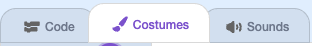
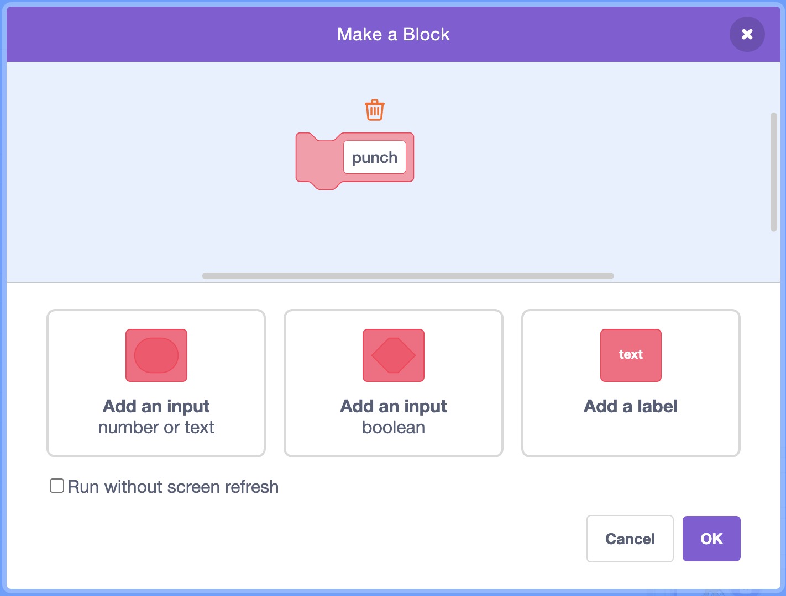

## Animate a punch

Turn a set of costumes into a punch animation that runs when the player presses a key.

> [!TASK]
>
> Open the [Stickman Battle starter project](https://scratch.mit.edu/projects/1363542597/editor){:target="_blank"} in a new tab. Your fighter already has all its animation pictures drawn as costumes.

> [!TASK]
>
> Select the **player** sprite.
>
> <p align="center"></p>
>
> Open the **Costumes** tab and find **punch_01** to **punch_06**. These costumes make up one punch.
>
> 

> [!TIP]
>
> Showing still pictures quickly, one after another, makes the sprite look as though it is moving. This is animation.

> [!TASK]
>
> Open the **Code** tab. `My Blocks`{:class="block3myblocks"} groups blocks together to organise your code. Open the `My Blocks`{:class="block3myblocks"} menu and click **Make a Block**.
>
> 
>
> Name it `punch`{:class="block3myblocks"} and click **OK**.
>
> 
>
> A `define punch`{:class="block3myblocks"} block appears in the Code area.
>
> 

> [!TIP]
>
> A block you make yourself can run a group of blocks with one instruction. This is called **abstraction**.

> [!TASK]
>
> Under `define punch`{:class="block3myblocks"}, add `start sound`{:class="block3sound"} and choose **Tennis Hit** from its menu. Then switch through the punch costumes with a short wait after each one.
>
> ```blocks3
> define punch
> start sound (Tennis Hit v)
> switch costume to (punch_01 v)
> wait (0.01) seconds
> switch costume to (punch_02 v)
> wait (0.01) seconds
> switch costume to (punch_03 v)
> wait (0.01) seconds
> switch costume to (punch_04 v)
> wait (0.01) seconds
> switch costume to (punch_05 v)
> wait (0.01) seconds
> switch costume to (punch_06 v)
> wait (0.01) seconds
> switch costume to (punch_02 v)
> wait (0.01) seconds
> switch costume to (punch_01 v)
> wait (0.02) seconds
> ```

> [!TIP]
>
> The animation runs to **punch_06**, then returns through **punch_02** to **punch_01**, so the arm comes back to rest.

> [!TASK]
>
> Add a `when space key pressed`{:class="block3events"} block and place `punch`{:class="block3myblocks"} under it.
>
> ```blocks3
> when [space v] key pressed
> punch :: custom
> ```

**Test:** Click the green flag, then press `space`{:class="block3events"}. Your fighter should throw a punch and return to its first punch costume.
