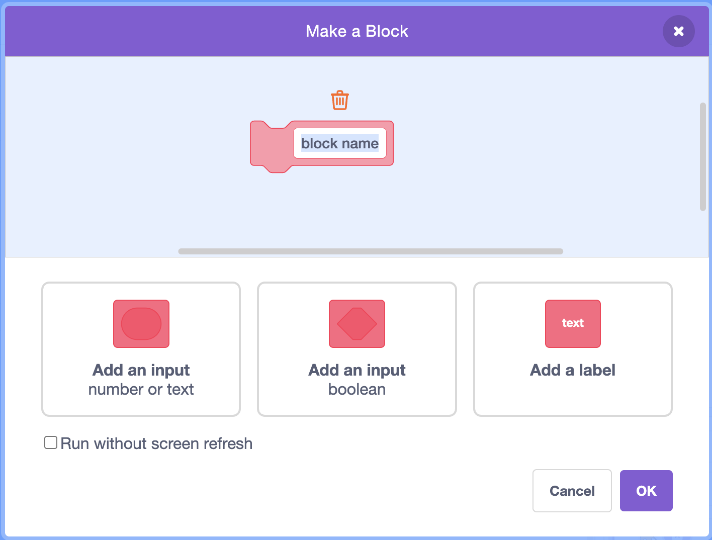
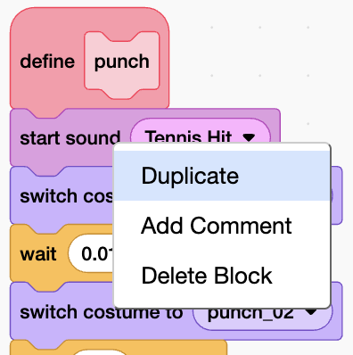

## Add the other moves

Your fighter needs more than a punch. A kick, a sword slash, a jump, and a dash roll all work the same way as the punch — a sound, then a run of frames — so you can build them fast by copying the punch and swapping the frames.

> [!TASK]
>
> Make a new custom block called `kick`{:class="block3custom"}. In the **My Blocks** palette, click **Make a Block**.
>
> 
>
> Name it `kick`{:class="block3custom"} and click **OK**, so a `define kick`{:class="block3custom"} hat appears.
>
> 

> [!TASK]
>
> Instead of building the kick from scratch, copy the punch. Right-click the first block under `define punch`{:class="block3custom"} and choose **Duplicate**, then drop the copied stack under `define kick`{:class="block3custom"}.
>
> 

> [!TIP]
>
> Copying code you've already written instead of retyping it saves time and mistakes. When you find yourself building the same shape again, look for something to reuse.

> [!TASK]
>
> Change the copied blocks to use the kick's sound and frames. **Check the Costumes tab first:** the kick has frames `kick_01` to `kick_06`, and the animation reuses `kick_03` on the way back — that's a different number of frames from the punch, so you'll need to remove or add `switch costume to`{:class="block3looks"} / `wait`{:class="block3control"} pairs until they match.
>
> <p align="center"></p>
>
> ```blocks3
> define kick
> start sound (Suction Cup v)
> switch costume to (kick_01 v)
> wait (0.01) seconds
> switch costume to (kick_02 v)
> wait (0.01) seconds
> switch costume to (kick_03 v)
> wait (0.01) seconds
> switch costume to (kick_04 v)
> wait (0.01) seconds
> switch costume to (kick_05 v)
> wait (0.01) seconds
> switch costume to (kick_03 v)
> wait (0.01) seconds
> switch costume to (kick_06 v)
> wait (0.02) seconds
> ```

> [!TIP]
>
> Every animation has its own number of frames, so you can't assume two moves are the same length. Counting the costumes before you build saves you a puzzling half-finished animation later.

> [!TASK]
>
> Run the kick from the `m`{:class="block3sensing"} key.
>
> <p align="center"></p>
>
> ```blocks3
> when [m v] key pressed
> kick :: custom
> ```

**Test:** Press `m`{:class="block3sensing"}. Your fighter kicks. Fix any frame that looks out of order before moving on.

> [!TASK]
>
> Do the same for a sword slash. Make a `sword`{:class="block3custom"} block, copy the pattern, and set it to the eight `sword_slash` frames (it ends on `sword_slash_07` to bring the blade back).
>
> <p align="center"></p>
>
> ```blocks3
> define sword
> start sound (Rip v)
> switch costume to (sword_slash_01 v)
> wait (0.01) seconds
> switch costume to (sword_slash_02 v)
> wait (0.01) seconds
> switch costume to (sword_slash_03 v)
> wait (0.01) seconds
> switch costume to (sword_slash_04 v)
> wait (0.01) seconds
> switch costume to (sword_slash_05 v)
> wait (0.01) seconds
> switch costume to (sword_slash_06 v)
> wait (0.01) seconds
> switch costume to (sword_slash_07 v)
> wait (0.01) seconds
> switch costume to (sword_slash_08 v)
> wait (0.01) seconds
> switch costume to (sword_slash_07 v)
> wait (0.02) seconds
> ```
>
> <p align="center"></p>
>
> ```blocks3
> when [n v] key pressed
> sword :: custom
> ```

**Test:** Press `n`{:class="block3sensing"}. Your fighter swings the sword.

> [!TASK]
>
> Make a `jump`{:class="block3custom"} block for the seven `jump` frames, and run it from the `up arrow`{:class="block3sensing"} key.
>
> <p align="center"></p>
>
> ```blocks3
> define jump
> start sound (Rip v)
> switch costume to (jump_01 v)
> wait (0.01) seconds
> switch costume to (jump_02 v)
> wait (0.01) seconds
> switch costume to (jump_03 v)
> wait (0.01) seconds
> switch costume to (jump_04 v)
> wait (0.01) seconds
> switch costume to (jump_05 v)
> wait (0.01) seconds
> switch costume to (jump_06 v)
> wait (0.01) seconds
> switch costume to (jump_07 v)
> wait (0.02) seconds
> ```
>
> <p align="center"></p>
>
> ```blocks3
> when [up arrow v] key pressed
> jump :: custom
> ```

> [!TASK]
>
> Last one: a dash roll. This move also **slides the fighter forward** as it animates, so a `move`{:class="block3motion"} block goes before each frame. Make a `roll`{:class="block3custom"} block and run it from the `v`{:class="block3sensing"} key.
>
> <p align="center"></p>
>
> ```blocks3
> define roll
> start sound (Rip v)
> move (5) steps
> switch costume to (dash_roll_01 v)
> wait (0.01) seconds
> move (5) steps
> switch costume to (dash_roll_02 v)
> wait (0.01) seconds
> move (5) steps
> switch costume to (dash_roll_03 v)
> wait (0.01) seconds
> move (5) steps
> switch costume to (dash_roll_04 v)
> wait (0.01) seconds
> move (5) steps
> switch costume to (dash_roll_05 v)
> wait (0.01) seconds
> wait (0.02) seconds
> ```
>
> <p align="center"></p>
>
> ```blocks3
> when [v v] key pressed
> roll :: custom
> ```

> [!TIP]
>
> The roll is your fighter's escape move, so make it feel right. Try changing every `move (5) steps`{:class="block3motion"} in `roll`{:class="block3custom"} to a bigger number for a long, fast dash, or a smaller one for a short hop. Keep the five `move`{:class="block3motion"} blocks the same as each other so the roll travels smoothly, and test until the distance feels good.

**Test:** Try every key — `space`{:class="block3sensing"}, `m`{:class="block3sensing"}, `n`{:class="block3sensing"}, `up arrow`{:class="block3sensing"}, and `v`{:class="block3sensing"}. Each one should play its own move.
