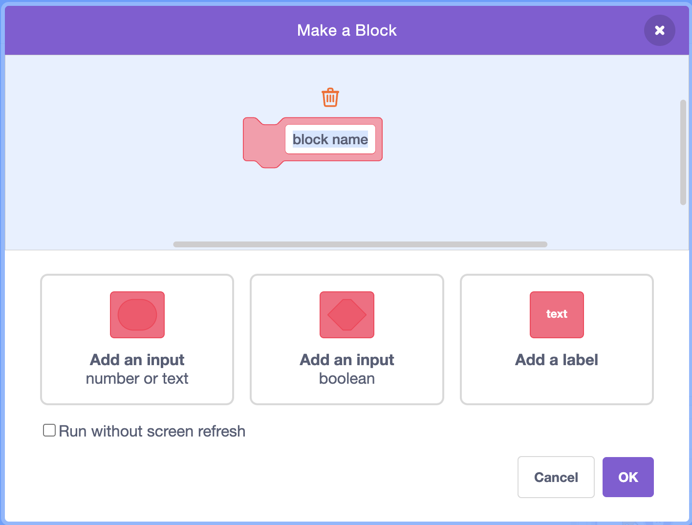

## Add the other moves

The kick, sword slash, and jump all work like the punch: a sound followed by a run of costume switches. Build them quickly by copying the punch and changing the costumes.

> [!TASK]
>
> On the **player** sprite, make a new block called `kick`{:class="block3myblocks"}. Open the `My Blocks`{:class="block3myblocks"} menu and click **Make a Block**.
>
> 
>
> Name it `kick`{:class="block3myblocks"} and click **OK**. A `define kick`{:class="block3myblocks"} block appears.
>
> 

> [!TASK]
>
> Right-click the first block under `define punch`{:class="block3myblocks"} and choose **Duplicate**. Drop the copied stack under `define kick`{:class="block3myblocks"}.
>
> 

> [!TASK]
>
> Change the copied blocks to use the kick's sound and costumes.
>
> The kick uses a different number of costumes from the punch. Remove the extra `switch costume to`{:class="block3looks"} and `wait`{:class="block3control"} blocks until your script matches this one:
>
> ```blocks3
> define kick
> start sound (Suction Cup v)
> switch costume to (kick_01 v)
> wait (0.01) seconds
> switch costume to (kick_02 v)
> wait (0.01) seconds
> switch costume to (kick_03 v)
> wait (0.01) seconds
> switch costume to (kick_04 v)
> wait (0.01) seconds
> switch costume to (kick_05 v)
> wait (0.01) seconds
> switch costume to (kick_03 v)
> wait (0.01) seconds
> switch costume to (kick_06 v)
> wait (0.02) seconds
> ```

> [!TASK]
>
> Add a `when m key pressed`{:class="block3events"} block and run `kick`{:class="block3myblocks"} from it.
>
> ```blocks3
> when [m v] key pressed
> kick :: custom
> ```

**Test:** Press `m`{:class="block3events"}. Your fighter kicks. Fix any costume that looks out of order before moving on.

> [!TASK]
>
> Repeat these actions for the sword slash:
>
> 1. Make a `sword`{:class="block3myblocks"} block.
> 2. Duplicate the costume-switching blocks.
> 3. Change them to the eight **sword_slash** costumes. End on **sword_slash_07** to bring the blade back.
> 4. Add a `when n key pressed`{:class="block3events"} block to run it.
>
> ```blocks3
> define sword
> start sound (Rip v)
> switch costume to (sword_slash_01 v)
> wait (0.01) seconds
> switch costume to (sword_slash_02 v)
> wait (0.01) seconds
> switch costume to (sword_slash_03 v)
> wait (0.01) seconds
> switch costume to (sword_slash_04 v)
> wait (0.01) seconds
> switch costume to (sword_slash_05 v)
> wait (0.01) seconds
> switch costume to (sword_slash_06 v)
> wait (0.01) seconds
> switch costume to (sword_slash_07 v)
> wait (0.01) seconds
> switch costume to (sword_slash_08 v)
> wait (0.01) seconds
> switch costume to (sword_slash_07 v)
> wait (0.02) seconds
> ```
> ```blocks3
> when [n v] key pressed
> sword :: custom
> ```

**Test:** Press `n`{:class="block3events"}. Your fighter swings the sword.

> [!TASK]
>
> Repeat the same four actions for a `jump`{:class="block3myblocks"} block. Use the seven **jump** costumes and add a `when up arrow key pressed`{:class="block3events"} block to run it.
>
> ```blocks3
> define jump
> start sound (Rip v)
> switch costume to (jump_01 v)
> wait (0.01) seconds
> switch costume to (jump_02 v)
> wait (0.01) seconds
> switch costume to (jump_03 v)
> wait (0.01) seconds
> switch costume to (jump_04 v)
> wait (0.01) seconds
> switch costume to (jump_05 v)
> wait (0.01) seconds
> switch costume to (jump_06 v)
> wait (0.01) seconds
> switch costume to (jump_07 v)
> wait (0.02) seconds
> ```
> ```blocks3
> when [up arrow v] key pressed
> jump :: custom
> ```

**Test:** Try `space`{:class="block3events"}, `m`{:class="block3events"}, `n`{:class="block3events"}, and `up arrow`{:class="block3events"}. Each key should play its own move.
