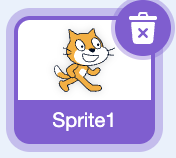
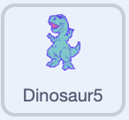
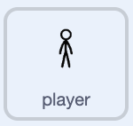

## Add an enemy

Time to give your fighter something to fight. You'll add an enemy that keeps appearing from both sides of the stage and marching in.

> [!TASK]
>
> Add an enemy sprite with **Choose a Sprite**. The demo uses a dinosaur, but pick whatever you like — a dragon, a robot, a giant crab, a rival monster, or something you paint yourself. An enemy with several costumes will animate as it moves.
>
> 

> [!TASK]
>
> If your starter already has an enemy you don't want, delete it with the bin icon on its thumbnail.
>
> 

> [!TASK]
>
> Make two variables the enemy needs: `playing`{:class="block3variables"} already exists, so add `side`{:class="block3variables"} (which side an enemy comes from). **Untick** it — the player doesn't need to see it.

> [!TASK]
>
> On the enemy sprite, set it up on the green flag: hide the original, park it at the right edge, and give it left-right rotation so it faces your fighter.
>
> <p align="center"></p>
>
> ```blocks3
> when green flag clicked
> hide
> go to x: (280) y: (0)
> set rotation style [left-right v]
> ```

> [!TIP]
>
> You'll make copies of the enemy with **clones**, so the original just needs to hide and wait. A **clone** is a working copy of a sprite that runs its own scripts — perfect for spawning wave after wave of enemies from one sprite.

> [!TASK]
>
> Make the enemy spawn from a random side, over and over, while the game is playing. Add this to the enemy sprite.
>
> <p align="center"></p>
>
> ```blocks3
> when I receive (dino v)
> repeat until <(playing) = (0)>
> set [side v] to (pick random (1) to (2))
> if <(side) = (1)> then
> go to x: (-280) y: (0)
> create clone of (myself v)
> else
> go to x: (280) y: (0)
> create clone of (myself v)
> end
> wait (1) seconds
> end
> ```

> [!TASK]
>
> Tell the enemy spawner to start. On the `player`{:class="block3looks"} sprite's green flag script, add `broadcast (dino v)`{:class="block3events"} right after `broadcast (fight v)`{:class="block3events"}.
>
> <p align="center"></p>
>
> ```blocks3
> when green flag clicked
> set [playing v] to (1)
> broadcast (fight v)
> +broadcast (dino v)
> ```

> [!TASK]
>
> Make each clone appear and walk towards your fighter, animating as it goes.
>
> <p align="center"></p>
>
> ```blocks3
> when I start as a clone
> show
> repeat until <(playing) = (0)>
> point towards (player v)
> move (2) steps
> next costume
> end
> delete this clone
> ```

**Test:** Click the green flag. After the intro, enemies appear from the left and right and close in on your fighter. They'll walk right through it for now — you'll fix that next.
