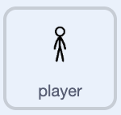

## Add an enemy

Add an enemy that appears from both sides of the stage and moves towards the fighter.

> [!TASK]
>
> Add a sprite with **Choose a Sprite**. Pick an enemy with several costumes so it can animate as it moves. The demo uses a dinosaur.
>
> 
>
> Rename the new sprite **enemy**.
>
> <p align="center"></p>

> [!TASK]
>
> Make a variable called `side`{:class="block3variables"}. **Untick** it so it does not appear on the stage. It will remember which side an enemy comes from.
>
> 

> [!TASK]
>
> On the **enemy** sprite, add a green flag script. Hide the original sprite, move it to the right edge, set its rotation style, and choose a size that fits the stage.
>
> ```blocks3
> when green flag clicked
> hide
> go to x: (280) y: (0)
> set rotation style [left-right v]
> set size to (70) %
> ```

Change `set size to 70%`{:class="block3looks"} if your enemy is too big or too small.

> [!TASK]
>
> On the **enemy** sprite, add a spawning loop. When it receives `dino`{:class="block3events"}, it should pick a random side — `1` or `2` — once a second while the game is running.
>
> In the `when I receive`{:class="block3events"} menu, choose **New message** and name it `dino`{:class="block3events"}.
>
> ```blocks3
> when I receive (dino v)
> repeat until <(playing) = (0)>
> set [side v] to (pick random (1) to (2))
> wait (1) seconds
> end
> ```

> [!TASK]
>
> A **clone** is a working copy of a sprite that runs its own scripts. Add blocks to create a clone on the chosen side: the left edge for side `1`, or the right edge for side `2`.
>
> ```blocks3
> when I receive (dino v)
> repeat until <(playing) = (0)>
> set [side v] to (pick random (1) to (2))
> +if <(side) = (1)> then
> +go to x: (-280) y: (0)
> +create clone of (myself v)
> else
> +go to x: (280) y: (0)
> +create clone of (myself v)
> end
> wait (1) seconds
> end
> ```

> [!TASK]
>
> Go back to the **player** sprite.
>
> <p align="center"></p>
>
> In its green flag script, add `broadcast dino`{:class="block3events"} after `broadcast ready`{:class="block3events"}.
>
> ```blocks3
> when green flag clicked
> switch costume to (walk_02 v)
> go to [front v] layer
> go to x: (0) y: (0)
> set rotation style [left-right v]
> point in direction (-90)
> set size to (250) %
> wait (1) seconds
> say [GOJIRA!!!!] for (2) seconds
> say [I will punch you into the shadow realm!] for (1.5) seconds
> set [playing v] to (1)
> broadcast (ready v)
> +broadcast (dino v)
> ```

> [!TASK]
>
> Go back to the **enemy** sprite.
>
> <p align="center"></p>
>
> Make each clone appear and move towards the **player**, changing costume as it moves.
>
> ```blocks3
> when I start as a clone
> show
> repeat until <(playing) = (0)>
> point towards (player v)
> move (2) steps
> next costume
> end
> delete this clone
> ```

**Test:** Click the green flag. After the intro, enemies should appear from the left and right and close in on your fighter. They'll walk right through it for now — you'll fix that next.
