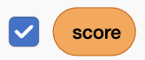
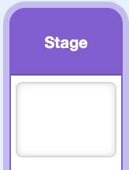
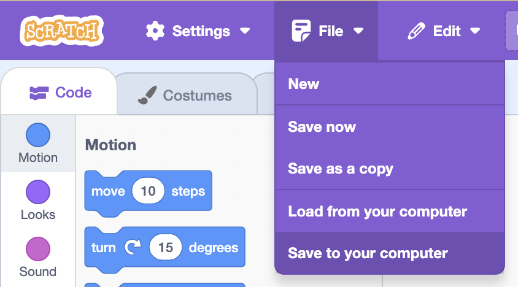

## Keep score and set the scene

Your game works — now reward the player for surviving, and choose when your battle takes place.

> [!TASK]
>
> Make two variables and **tick** both: `score`{:class="block3variables"} (how long the player has lasted) and `high score`{:class="block3variables"} (their best ever).
>
> 
>
> 

> [!TASK]
>
> Click the `Stage`{:class="block3looks"} and reset the score on the green flag.
>
> <p align="center"></p>
>
> ```blocks3
> when green flag clicked
> set [score v] to (0)
> ```

> [!TASK]
>
> Still on the `Stage`{:class="block3looks"}, count up one point per second while the game is playing, then save a new high score once the round ends.
>
> <p align="center"></p>
>
> ```blocks3
> when I receive (dino v)
> repeat until <(playing) = (0)>
> wait (1) seconds
> change [score v] by (1)
> end
> if <(score) > (high score)> then
> set [high score v] to (score)
> end
> ```

> [!TIP]
>
> Giving the player a number that climbs the longer they survive turns "don't die" into "beat your last score". A **high score** is a simple, powerful reason to play again.

> [!TASK]
>
> Set the scene. Click the `Stage`{:class="block3looks"}, open the **Backdrops** tab, and pick the time of day for your battle — the demo comes with a day, a sunset, and a night version of Tokyo. Choose whichever you like the look of.
>
> 

> [!TIP]
>
> The time of day sets the whole **mood** of a game. A bright day feels playful; a red sunset or dark night feels tense. Small art choices like this are a big part of how a game *feels*.

> [!TASK]
>
> **Optional:** make the game-over screen show the final score. On your fighter's `death`{:class="block3custom"} block, swap `say [GAME OVER] for (2) seconds`{:class="block3looks"} for `say (score) for (2) seconds`{:class="block3looks"} so the player sees how well they did.

> [!TASK]
>
> Save your project so you don't lose your work.
>
> 

> [!SAVE]

**Test:** Play a full round. Your score should climb each second, the game should end when your health runs out, and your best run should stick as the high score.
